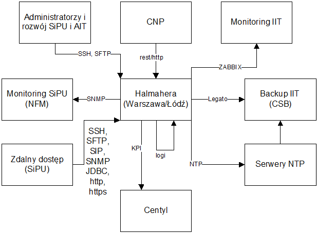

# IMS Ecosystem - przykład dokumentu

## High Level Design

Data utworzenia: 29.03.2019

Data ostatniej modyfikacji: 29.03.2019

Wersja: 1.00

Status: do akceptacji

## Spis treści

[1. Historia dokumentu](#_historia_dokumentu)

[2. Przykłady nagłówków](#_przyklady_naglowkow)

[3. Przykład użycia tabeli](#_przyklad_uzycia_tabeli)

[4. Przykład użycia tabeli z łączonymi komórkami w wersach](#_przyklad_uzycia_z_laczonymi_komorkami_w_wersach)

[5. Przykład użycia tabeli z łączonymi komórkami w wersach_i_kolumnach](#_przyklad_uzycia_z_laczonymi_komorkami_w_wersach_i_kolumnach)

[6. Blok tekstu - przykład](#_blok_tekstu)

[7. Przykład listy numerowanej](#_lista_numerowana)

[8. Przykład listy wypunktowanej z wcięciami](#_lista_wypunktowana)

[9. Formatowanie tekstu](#_formatowanie_tekstu)

[10. Użycie linku](#_link)

[11. Wstawienie rysunku](#_rysunek)

[12. Wstawienie dokumentu](#_dokument)

## Historia dokumentu

| LP      | Autor | Zakres | Data |
| ----------- | ----------- | ---------- | ------------- |
| 1 | Vimana Solutions | Utworzenie dokumentu| 01.04.2019 |

## Przykłady nagłówków
# Nagłowek stopnia 1
## Nagłowek stopnia 2
### Nagłowek stopnia 3
#### Nagłowek stopnia 4

## Przykład użycia tabeli:

| Kolumna 1 | Kolumna 2 | Kolumna 3 | Kolumna 4 | Kolumna 5 |
|---|---|---|---|---|
|kolumna 1, wiersz 1 | k2, w1 | k3, w1 | k4, w1 | k5, w1 |
|kolumna 1, wiersz 2 | k2, w2 | k3, w2 | k4, w2 | k5, w2 |
|kolumna 1, wiersz 2 | k2, w2 | k3, w2 | k4, w2 | k5, w2 |

## Przykład użycia tabeli z łączonymi komórkami w wersach:

| Kolumna 1 | Kolumna 2 | Kolumna 3 | Kolumna 4 | Kolumna 5 |
|---|---|---|---|---|
|kolumna 1, wiersz 2 <td colspan="2">2 komórki połączone <td colspan="2">2 komórki połączone
|kolumna 1, wiersz 2 <td colspan="3">3 komórki połączone <td>komórka

## Przykład użycia tabeli z łączonymi komórkami w wersach i kolumnach:

<table>
    <thead>
        <tr>
            <th>Kolumna 1</th>
            <th>Kolumna 2</th>
            <th>Kolumna 3</th>
        </tr>
    </thead>
    <tbody>
        <tr>
            <td rowspan=4>K1, w1, 2, 3 i 4</td>
            <td rowspan=2>K2, w1 i 2</td>
            <td>K3, w 1</td>
        </tr>
        <tr>
            <td>K3, w2</td>
        </tr>
        <tr>
            <td rowspan=2>K2, w3 i 4</td>
            <td>K3, w3</td>
        </tr>
        <tr>
            <td>K3, w4</td>
        </tr>
    </tbody>
</table>

## Blok tekstu - przykład:
> "Lorem ipsum dolor sit amet, consectetur adipisicing elit. Proin nibh augue, suscipit a, scelerisque sed, lacinia in, mi. Cras vel lorem. Etiam pellentesque aliquet tellus. Phasellus pharetra nulla ac diam. Quisque semper justo at risus. Donec venenatis, turpis vel hendrerit interdum, dui ligula ultricies purus, sed posuere libero dui id orci. Nam congue, pede vitae dapibus aliquet, elit magna vulputate arcu, vel tempus metus leo non est. Etiam sit amet lectus quis est congue mollis. Phasellus congue lacus eget neque. Phasellus ornare, ante vitae consectetuer consequat, purus sapien ultricies dolor, et mollis pede metus eget nisi. Praesent sodales velit quis augue. Cras suscipit, urna at aliquam rhoncus, urna quam viverra nisi, in interdum massa nibh nec erat."

## Przykład listy numerowanej:
1. Punkt pierwszy, punkt pierwszy, punkt pierwszy,punkt pierwszy,punkt pierwszy,punkt pierwszy,punkt pierwszy,punkt pierwszy,punkt pierwszy,punkt pierwszy
   * podpunkt
   * kolejny podpunkt
2. Punkt drugi
3. Punkt trzeci

## Przykład listy wypunktowanej z wcięciami:
Lista wypunktowana:
* punt pierwszy
* punkt drugi
* punkt trzeci
  * podpunkt
  * podpunkt
    *  zagnieżdżenie podpunktu
    *  kolejne zagnieżdżenie podpunktu
* punkt czwarty

## Formatowanie tekstu:
**tekst pogrubiony**

==tekst zaznaczony==

*tekst pochylony*

## Użycie linku:
[Przykład linku do zasobów sieci](http://google.pl)

## Wstawienie rysunku
Rysunek 1:

## Dołączenie dokumentu

Tutaj przykład dokumentu dołączonego
[czytaj](included.md)

 